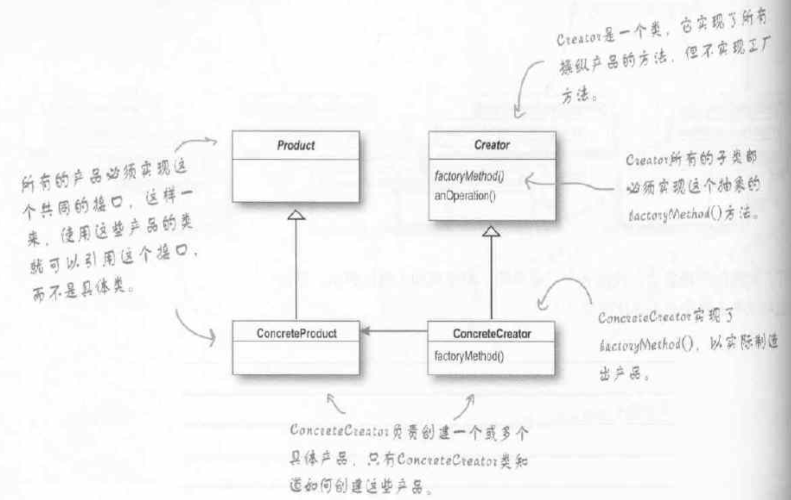

# 工厂方法模式

定义：

定义了一个创建对象的接口，但由子类决定要实例化的类是哪一个。

类图：

代码：

[FactoryMethod.java](./code/src/FactoryMethod.java)

注：

- Creator中放一个方法，这个方法用来创建对象。这个方法就称为工厂方法。
- 有点像模板模式。也是把父类的方法声明为抽象，让子类来实现。只不过方法不是模板中的步骤，而是用来创建对象的。而且方法只有一个。