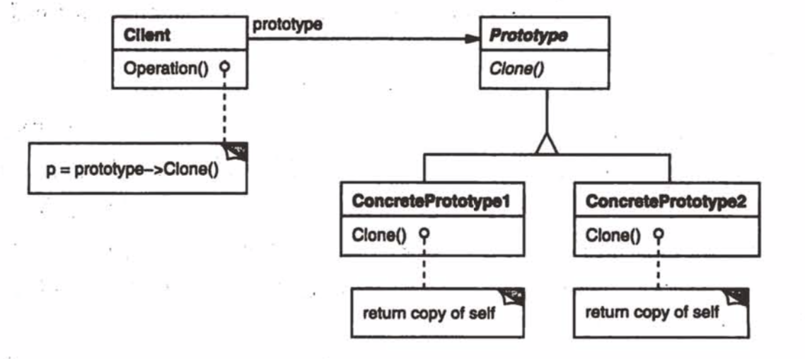

# Prototype

定义：

用原型实例指定创建对象的种类，并且通过拷贝这些原型创建新的对象。

类图：

代码：

[Prototype.java](./code/src/Prototype.java)

注：

- 有点像抽象工厂模式。在抽象工厂模式中，Client会用AbstractFactory创建不同的Product，来完成某个方法。而在原型模式中，也是在Client中创建一些对象来完成方法，只是这里不是创建不同的Product，而是克隆原型本身。

应用：

- 乐谱编辑器（来自《设计模式：可复用面向对象软件的基础》）